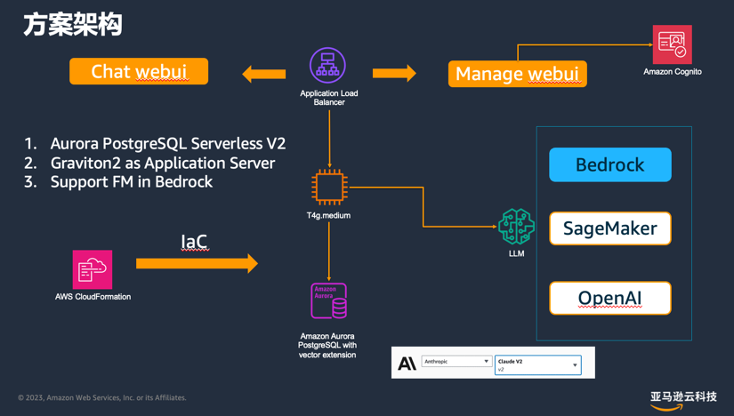
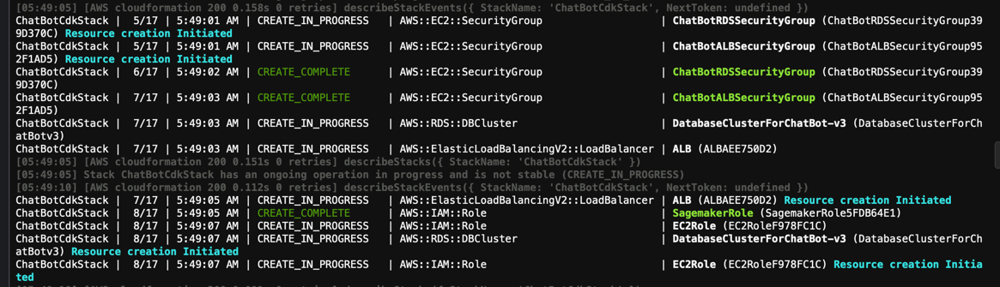
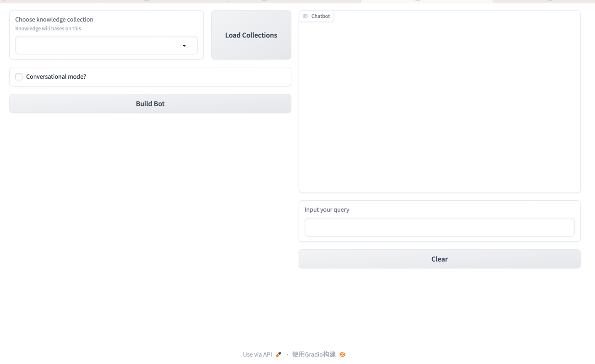
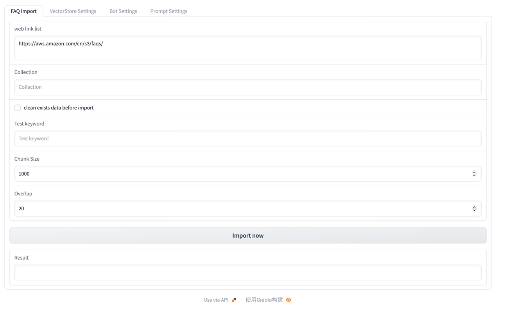
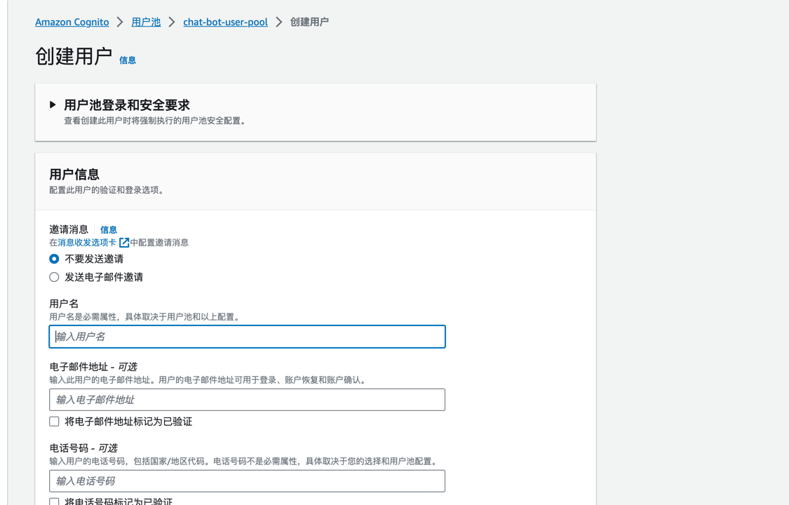

# 使用说明

## 部署和使用

程序是基于Java的[AWS CDK](doc/java%20cdk.md)代码， 帮助一键部署智能问答应用: https://github.com/nimysan/ChatBotWebUI



### 依赖条件

[安装AWS CDK](https://docs.aws.amazon.com/cdk/v2/guide/getting_started.html)

[安装Java和Maven](https://docs.aws.amazon.com/cloud9/latest/user-guide/sample-java.html)

### 部署前环境检查

```bash

$ cdk --version
!!!!!!!!!!!!!!!!!!!!!!!!!!!!!!!!!!!!!!!!!!!!!!!!!!!!!!!!!!!!!!!!!!!!!!!!!!!!!!!!
!!                                                                            !!
!!  Node 16 has reached end-of-life on 2023-09-11 and is not supported.       !!
!!  Please upgrade to a supported node version as soon as possible.           !!
!!                                                                            !!
!!  This software is currently running on node v16.20.2.                      !!
!!  As of the current release of this software, supported node releases are:  !!
!!  - ^20.0.0 (Planned end-of-life: 2026-04-30)                               !!
!!  - ^18.0.0 (Planned end-of-life: 2025-04-30)                               !!
!!                                                                            !!
!!!!!!!!!!!!!!!!!!!!!!!!!!!!!!!!!!!!!!!!!!!!!!!!!!!!!!!!!!!!!!!!!!!!!!!!!!!!!!!!
2.96.2 (build 3edd240)

$ java --version
openjdk 17.0.8.1 2023-08-22 LTS
OpenJDK Runtime Environment Corretto-17.0.8.8.1 (build 17.0.8.1+8-LTS)
OpenJDK 64-Bit Server VM Corretto-17.0.8.8.1 (build 17.0.8.1+8-LTS, mixed mode, sharing)

$ mvn --version
Apache Maven 3.0.5 (Red Hat 3.0.5-17)
Maven home: /usr/share/maven
Java version: 17.0.8.1, vendor: Amazon.com Inc.
Java home: /usr/lib/jvm/java-17-amazon-corretto.x86_64
Default locale: en_US, platform encoding: UTF-8
OS name: "linux", version: "4.14.322-246.539.amzn2.x86_64", arch: "amd64", family: "unix"
```

### 部署操作

#### 创建一个EC2的key pair备用

部署步骤

```bash
# check out code
git clone https://github.com/nimysan/ChatBotCDK.git
cd ChatBotCDK
cat run_sample.sh # 检查并修改参数符合环境实际情况 （keypair名字需要修改为你环境的实际名字）

# 如果环境之前从来没有执行过CDK 请执行
cdk bootstrap

 ⏳  Bootstrapping environment aws://765094959498/us-east-1...
Trusted accounts for deployment: (none)
Trusted accounts for lookup: (none)
Using default execution policy of 'arn:aws:iam::aws:policy/AdministratorAccess'. Pass '--cloudformation-execution-policies' to customize.
CDKToolkit: creating CloudFormation changeset...
 ✅  Environment aws://765094959498/us-east-1 bootstrapped.

#执行部署
./run_sample.sh # 完整的CDK会创建相应的数据库和EC2， 并部署ALB到做服务透出， 预计需要10分钟左右
```



### 部署完成

CDK执行完成后, 可以在output找到后续登录web的URL和用户名和密码


输出说明:

1. ALBEndpoint 可以公网访问的程序入口

* ${ALBEndpoint}/chat: 是web访问界面



* ${ALBEndpoint}/manage: 是管理员访问入口



#### 创建管理员账户

找到通过CDK创建的Cognito User pool, 创建一个用户（用户名和密码）, 之后可以使用该用户名和密码访问 manage 应用



可以在部署页面找到以下输出

* chat: 提供给智能问答用户使用。 选定知识库并开始做问答

* manage: 提供给管理元使用， 通过manage配置模型、导入知识库等操作

Enjoy!

应用具体的使用和说明请参考： https://github.com/nimysan/ChatBotWebUI
